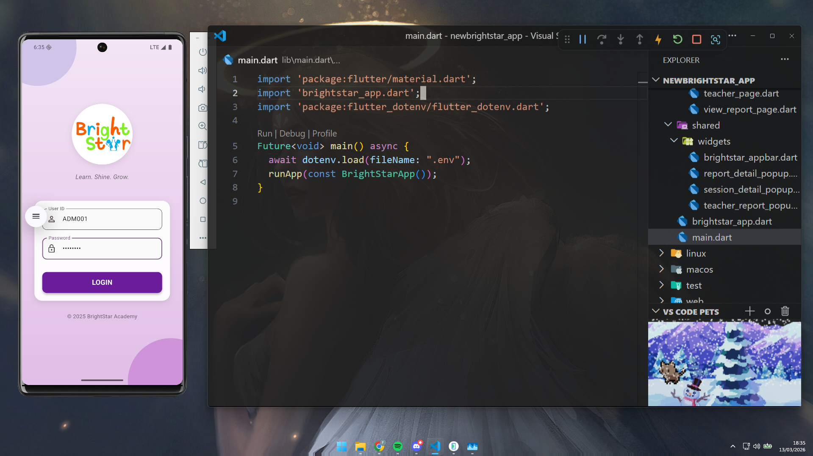
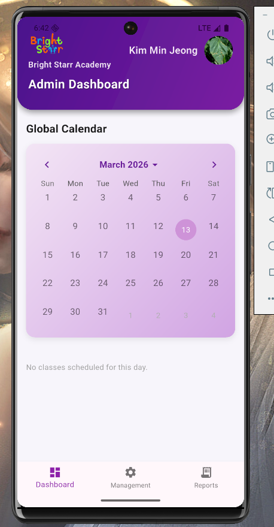
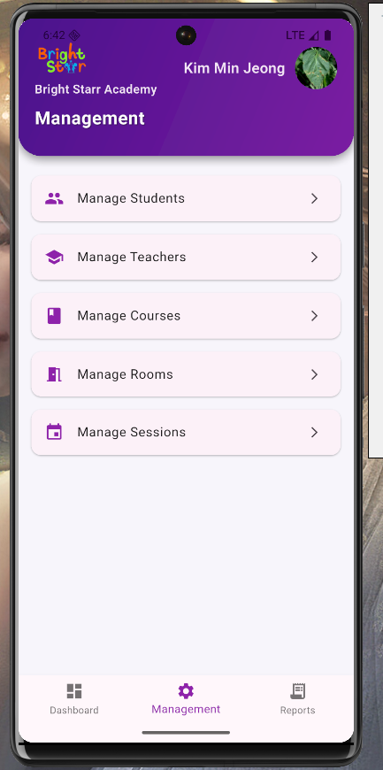
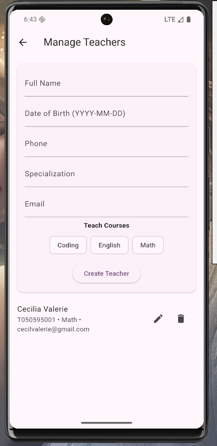
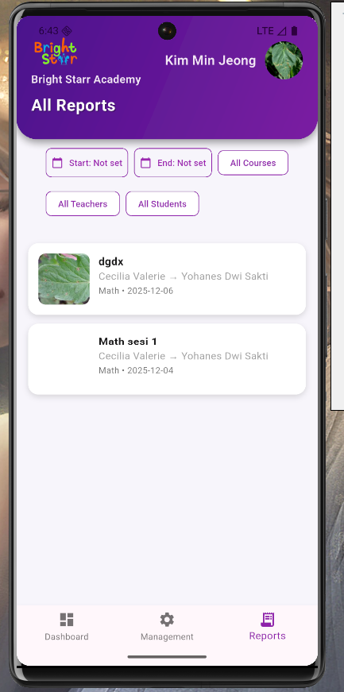
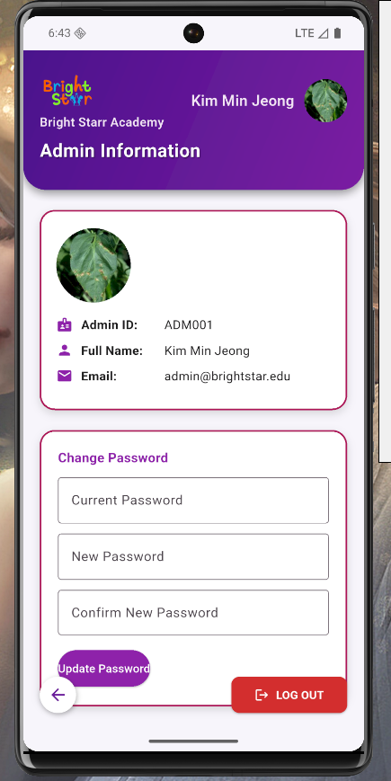

# 🌟 BrightStar

BrightStar is a mobile-based Learning Management System (LMS) designed to manage educational activities through a structured, database-driven system.

---

## 📸 Preview

  

  
  
  

  
  

---

## 🚀 Overview

BrightStar is developed to replace manual academic data management with a fully digital and automated system.

The platform supports multiple roles — including Admin, Teacher, and Student — enabling efficient management of users, courses, sessions, and learning progress.

The system is built on a structured database design to ensure data consistency, scalability, and accuracy across all operations. :contentReference[oaicite:0]{index=0}

---

## 🎯 Core Features

- Multi-role system (Admin, Teacher, Student)  
- Course and session management  
- Student enrollment and scheduling system  
- Teacher assignment and specialization mapping  
- Learning progress reports with detailed tracking  
- Authentication and account management  
- Real-time data operations integrated with database  

---

## 🧠 System Design

BrightStar is designed as a **database-centric system**, including:

- Relational database modeling (ERD)  
- Normalization up to 3NF / BCNF  
- Structured entity relationships (users, courses, sessions, reports, etc.)  
- Data integrity constraints (schedule conflicts, room capacity, role restrictions)  
- Stored procedures for critical operations (e.g., enrollment, reporting)  

The system ensures consistency and prevents anomalies through proper database design principles. :contentReference[oaicite:1]{index=1}

---

## 🛠️ Tech Stack

Flutter • Dart  
MySQL • XAMPP  
JDBC / Database Integration  

---
## ⚡ Notes

BrightStar demonstrates the integration of mobile application development with robust database system design, combining user experience with backend data architecture to deliver a scalable learning platform.
